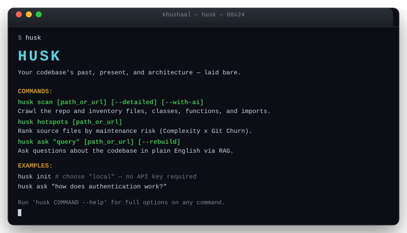

# Husk

*Your codebase's past, present, and architecture—laid bare.*

Understand legacy codebases quickly and privately with offline static analysis and local LLMs, without uploading code or fighting heavy setups.

[](https://github.com/khushalv21/Husk/actions/workflows/test.yml)
[](https://pypi.org/project/husk-local/)
[](pyproject.toml)
[](LICENSE)



---

## ❓ Why Husk?
> Because code archaeology should be secure, local, and instant — without SaaS lock-in or platform-specific vector databases.

---

## 🚀 Key Features

* **Static Analysis (Tier 1):** Code complexity, git churn, hotspots rankings, dead code detection, and Mermaid dependency graph exports.
* **Semantic AI (Tier 2):** Hierarchical Map-Reduce documentation generator, token/budget limits, and natural language Q&A index with Git Blame annotations.
* **Remote Git Scanning:** Provide a Git clone link (`https://github.com/...`) instead of a local directory, and Husk will automatically download and scan it temporarily.
* **Local Offline AI:** Fully integrates with local Ollama servers (like `llama3`) for offline, zero-cost semantic search and summarization.
* **Zero-API-Key Mode:** No OpenAI/Anthropic account needed — `husk init` can auto-provision a small default model via Ollama so Husk works fully offline out of the box.

### Supported Languages

| Language   | Extensions              | Classes/Funcs | Imports | Complexity |
|------------|--------------------------|:---:|:---:|:---:|
| Python     | `.py`                    | ✅ | ✅ | ✅ |
| JavaScript | `.js` `.jsx` `.mjs` `.cjs`| ✅ | ✅ | ✅ |
| TypeScript | `.ts` `.tsx`              | ✅ | ✅ | ✅ |
| Java       | `.java`                  | ✅ | ✅ | ✅ |

C++ support is planned next (see [CONTRIBUTING.md](CONTRIBUTING.md) if you'd like to help).

---

## 💾 Installation

You can install Husk directly from PyPI:

```bash
pip install husk-local
```

---

## 📦 Quick Start

Once installed, you can start auditing any codebase immediately:

```bash
# Configure an AI provider — OpenAI, Anthropic, Ollama, or "local" (no API key needed)
husk init

# Scan a local folder or remote repository link
husk scan https://github.com/example/project.git --detailed

# Generate documentation suite statically or with AI
husk doc . --with-ai

# Query codebase using RAG
husk ask "how does authentication work?" https://github.com/example/project.git
```

No API key? Run `husk init` and choose the **`local`** provider — Husk will automatically pull a small
default model (`qwen2.5-coder:1.5b` for summarization/Q&A, `nomic-embed-text` for search) via
[Ollama](https://ollama.com/download) and everything above works fully offline at no cost.

Run `husk` with no arguments at any time to see the full command menu.

---

## 🛠️ CLI Commands

| Command | Description |
|---|---|
| `husk scan [path_or_url] [--detailed] [--with-ai]` | Crawl the repo and inventory files, classes, functions, and imports. |
| `husk graph [path_or_url] [--output path]` | Generate and visualize a Mermaid module dependency graph. |
| `husk hotspots [path_or_url]` | Rank source files by maintenance risk (Complexity × Git Churn). |
| `husk deadcode [path_or_url]` | Scan for unreferenced files in the module import graph. |
| `husk init` | Configure an AI provider — OpenAI, Anthropic, Ollama, or zero-key local. |
| `husk doc [path_or_url] [--with-ai]` | Generate structured documentation reports under `/docs`. |
| `husk ask "query" [path_or_url] [--rebuild]` | Ask questions about the codebase in plain English via RAG search. |

Every command accepts either a local path or a remote Git URL (`https://github.com/...`), which Husk
clones to a temporary directory and cleans up automatically.

---

## 🧑‍💻 Development

See [CONTRIBUTING.md](CONTRIBUTING.md) for local setup and testing instructions, and
[CHANGELOG.md](CHANGELOG.md) for release history.
